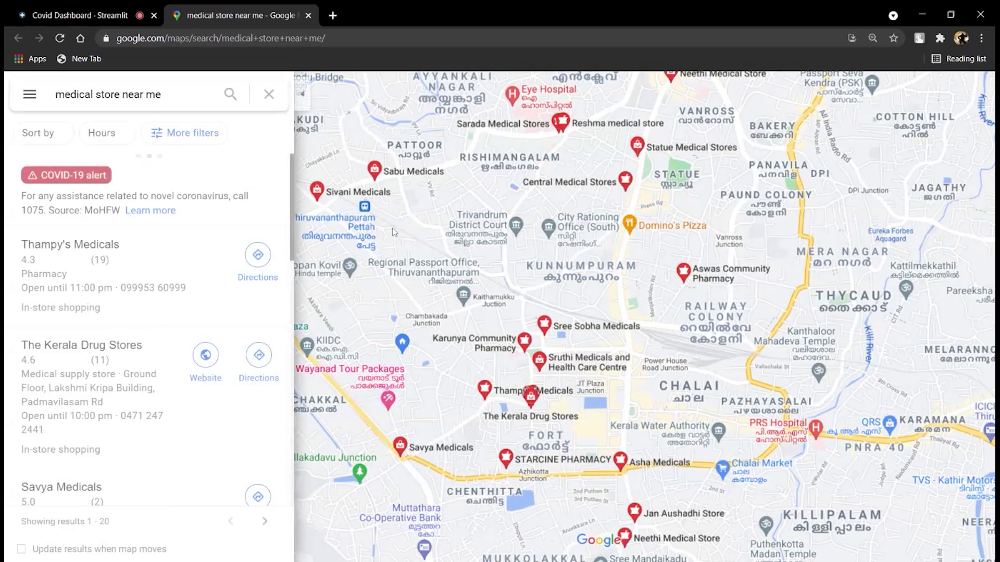

## Table of Contents

- [About the Project](#about-the-project)
  - [Built With](#built-with)
- [Getting Started](#getting-started-as-contributor)
  - [Prerequisites](#prerequisites)
  - [Installation](#installation)
- [Contact](#admins)

## About The Project

Checking vaccination slots have never been easier.
CoviStats is a Web application made with StreamLit, that shows detailed statistics of India's Covid status and also check available vaccination slots in just two clicks.

### Built With

- [Streamlit](https://streamlit.io//)

## Getting Started as Contributor

To get a local copy up and running follow these simple steps.

### Installation

Clone the repo   

    git clone https://github.com/gopik820/CoviStats

Install all the dependencies

    pip install -r requirements.txt

Run the app

    streamlit run app.py

## Screenshots

## Admins
Important decisions regarding the project are taken by the following maintainer.

| Arun Govind  | Gopikrishna  | Sai Siddharth  |
|---|---|---|
|      |   |  |
| [@arungovindm2001](https://github.com/arungovindm2001)  | [@gopik820](https://github.com/gopik820)     | [@siddharthc30](https://github.com/siddharthc30)  |

